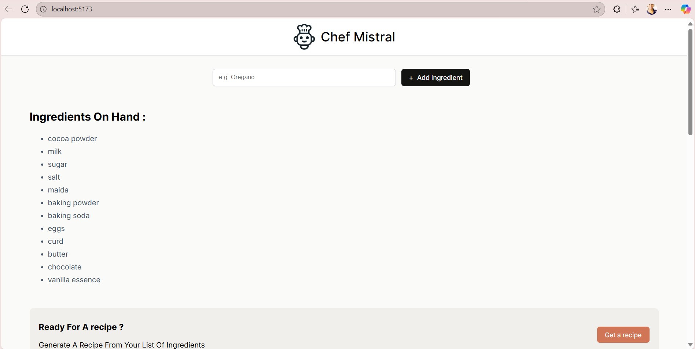

# Chef Mistral AI 👨‍🍳

A simple and fun React application that acts as your personal AI chef! Provide a list of ingredients you have, and Chef Mistral AI will generate a delicious recipe for you using the power of `mistralai/Mistral-7B-Instruct-v0.2`.



## ✨ Features

- **Ingredient-based Recipes**: Get recipe suggestions based on the ingredients you have on hand.
- **AI-Powered**: Utilizes the `mistralai/Mistral-7B-Instruct-v0.2` model through the Hugging Face Inference API.
- **Simple Interface**: Easily add ingredients and generate a recipe with a single click.
- **Loading State**: A friendly message lets you know the chef is at work while the recipe is being created.
- **Markdown Support**: Displays the generated recipe with formatting for easy reading.

## 🚀 Getting Started

Follow these instructions to get a copy of the project up and running on your local machine for development and testing purposes.

### Prerequisites

- Node.js (v18 or later is recommended)
- `npm`, `pnpm`, or `yarn`

### Installation

1.  **Clone the repository:**
    ```sh
    git clone https://github.com/your-username/chef-mistral-ai-react.git
    cd chef-mistral-ai-react
    ```

2.  **Install dependencies:**
    ```sh
    npm install
    ```

### Configuration

This project requires a Hugging Face User Access Token to communicate with the Inference API.

1.  If you don't have one, create a Hugging Face account and generate a new access token with `read` permissions from your Hugging Face settings.

2.  In the root directory of the project, create a new file named `.env`.

3.  Add your Hugging Face token to the `.env` file. Vite requires environment variables exposed to the client to be prefixed with `VITE_`.

    ```
    VITE_HF_TOKEN="hf_your_token_here"
    ```

## 🏃‍♂️ Running the Application

1.  **Start the development server:**
    ```sh
    npm run dev
    ```

2.  Open your browser and navigate to `http://localhost:5173` (or the address shown in your terminal).

3.  Start adding ingredients to the list and click "Get Recipe!" to see the magic happen.

## 🛠️ Built With

- React - The web framework used.
- Vite - Frontend tooling and development server.
- @huggingface/inference - To interact with the Hugging Face Inference API.
- react-markdown - To render the recipe with proper formatting.

## 📜 Scripts

- `npm run dev`: Starts the development server.
- `npm run build`: Builds the app for production.
- `npm run lint`: Lints the source files.
- `npm run preview`: Serves the production build locally.